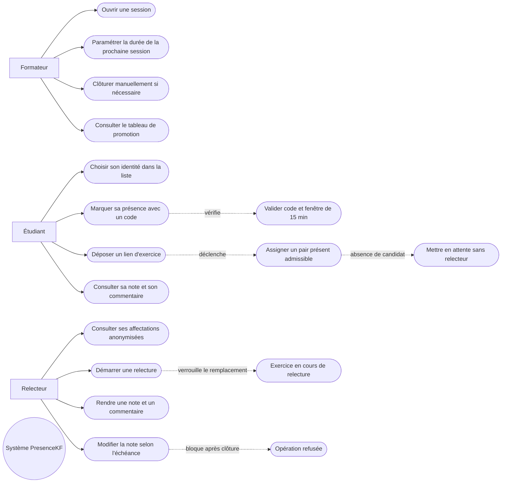

# D1 — Diagramme de cas d’utilisation

**Note métier :** le rôle de formateur inclut la modification de la durée globale, mais pas la clôture manuelle par défaut. La relecture est appliquée par l’étudiant affecté et anonymisé, sans que l’auteur soit visible du relecteur. Les étudiants ne peuvent relire que leur exercice, jamais le leur.
