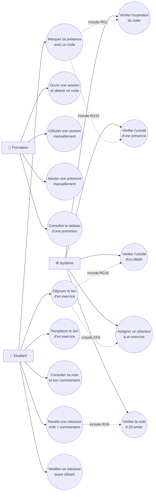

# D1 — Diagramme de cas d'utilisation

**Acteurs** : Formateur, Étudiant (relecteur dans un certain état), Système (acteur secondaire implicite).

**Périmètre** : toutes les fonctionnalités des EF1 à EF11.

```mermaid
flowchart LR
    %% Acteurs
    F[👤 Formateur]
    E[👤 Étudiant]
    S[⚙️ Système]

    %% Cas d'utilisation - Formateur
    UC1((Ouvrir une session<br/>et obtenir un code))
    UC2((Clôturer une session<br/>manuellement))
    UC3((Ajouter une présence<br/>manuellement))
    UC4((Consulter le tableau<br/>d'une promotion))

    %% Cas d'utilisation - Étudiant
    UC5((Marquer sa présence<br/>avec un code))
    UC6((Déposer le lien<br/>d'un exercice))
    UC7((Remplacer le lien<br/>d'un exercice))
    UC8((Consulter sa note<br/>et son commentaire))
    UC9((Rendre une relecture<br/>note + commentaire))
    UC10((Modifier sa relecture<br/>avant clôture))

    %% Cas d'utilisation - Système
    UC11((Assigner un relecteur<br/>à un exercice))
    UC12((Vérifier l'expiration<br/>du code))
    UC13((Vérifier la note<br/>0-20 entier))
    UC14((Vérifier l'unicité<br/>d'une présence))
    UC15((Vérifier l'unicité<br/>d'un dépôt))

    %% Associations Formateur
    F --> UC1
    F --> UC2
    F --> UC3
    F --> UC4

    %% Associations Étudiant (le relecteur est un étudiant affecté)
    E --> UC5
    E --> UC6
    E --> UC7
    E --> UC8
    E --> UC9
    E --> UC10

    %% Associations Système
    S --> UC11
    S --> UC12
    S --> UC13
    S --> UC14
    S --> UC15

    %% Includes (relations internes)
    UC5 -.->|include RG1| UC12
    UC5 -.->|include RG15| UC14
    UC6 -.->|include RG16| UC15
    UC6 -.->|include EF6| UC11
    UC9 -.->|include RG8| UC13
```

### Légende des acteurs

- **Formateur** : ouvre et clôture les sessions (EF2, EF11), ajoute des présences manuelles avec `source=FORMATEUR` (EF3), consulte le tableau par promotion (EF9).
- **Étudiant** : marque sa présence avec un code (EF1), dépose le lien de son exercice (EF4), remplace le lien avant relecture (EF5), consulte sa note sans voir le relecteur (EF10). Il peut aussi être relecteur d'un exercice d'un pair : c'est le même acteur dans un certain état.
- **Système** : acteur secondaire qui choisit automatiquement un relecteur (EF6), vérifie l'expiration du code (RG1), l'unicité des présences (RG15) et dépôts (RG16), et la validité de la note (RG8).

### Renvois aux règles et exigences

| Cas d'utilisation | Référence |
|---|---|
| UC1 Ouvrir une session | EF2, RG1 (expiration +15 min) |
| UC2 Clôturer une session | EF11, RG11, RG14 (manuelle, Q12) |
| UC3 Ajouter une présence manuellement | EF3, RG13 (`source=FORMATEUR`, Q14) |
| UC4 Consulter le tableau | EF9 (Q16) |
| UC5 Marquer sa présence | EF1, RG1, RG2, RG3, RG15 |
| UC6 Déposer un exercice | EF4, RG16 |
| UC7 Remplacer le lien | EF5, RG12, Q13 |
| UC8 Consulter sa note | EF10, RG7 (Q8) |
| UC9 Rendre une relecture | EF7, RG8, RG9 |
| UC10 Modifier sa relecture | EF8, RG9 (Q10 > Q15) |
| UC11 Assigner un relecteur | EF6, RG5, RG6 (Q6, Q7) |
| UC12 Vérifier l'expiration | RG1 (Q2) |
| UC13 Vérifier la note 0–20 | RG8 (Q9) |
| UC14 Unicité présence | RG15 |
| UC15 Unicité dépôt | RG16 |
