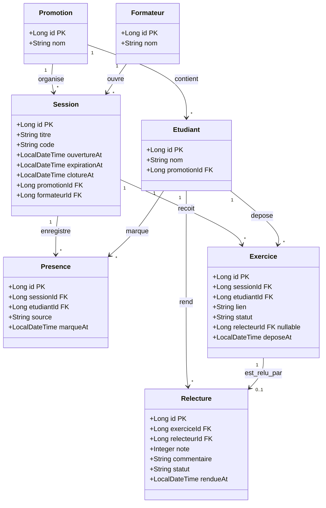

# D2 — Modèle de données

**Entités** : Promotion, Etudiant, Formateur, Session, Presence, Exercice, Relecture.

**Cohérence** : ce diagramme définit les tables visées par la migration Flyway `V1__init.sql`. Chaque classe correspond à une table et chaque attribut à une colonne.

`Exercice.relecteurId` est nullable : si aucun étudiant présent admissible n'est disponible pour relire l'exercice, il n'y a pas encore de relecteur affecté et l'exercice reste visible avec le statut `EN_ATTENTE_SANS_RELECTEUR` (Q7, Q11, Q12).
