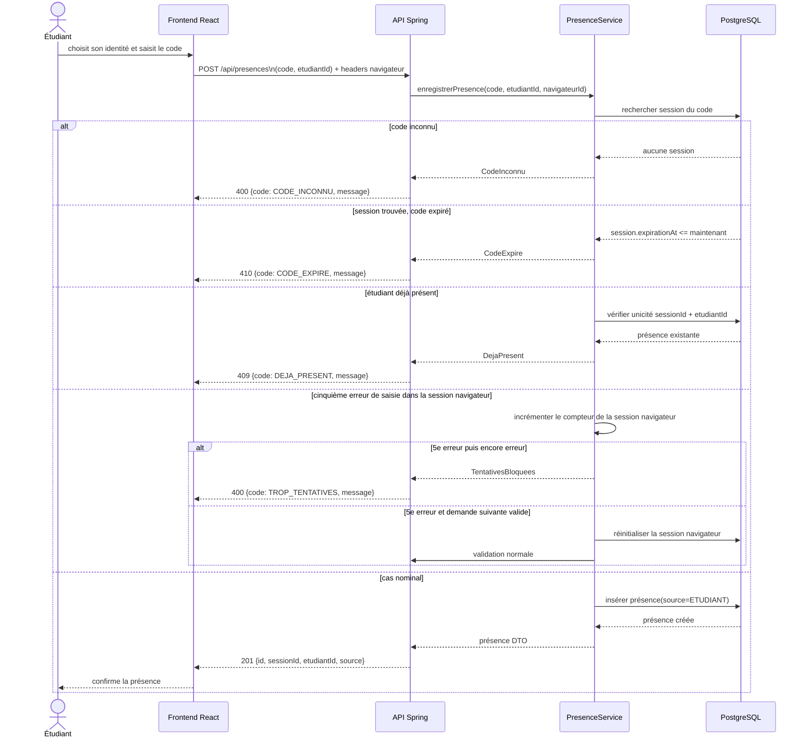

# D3 — Séquence : marquer sa présence

## Conformité du contrat

- Succès : `201`.
- Erreurs contractuelles : code inconnu `400`, déjà présent `409`, code expiré `410`.
- L’extension du candidat utilise toujours `400` pour la cinquième tentative, avec `code: TROP_TENTATIVES`.
- Le schéma d’erreur, `{ "code": "…" , "message": "…" }`, est imposé pour toutes les erreurs, sans exception, comme indiqué dans le sujet.

## Portée du compteur Q4

La décision du candidat est explicite : toute erreur serving (code inconnu, code expiré, présence déjà enregistrée) incrémente le compteur. Une fois la cinquième erreur atteinte, le reste des tentatives de cette session navigateur est bloqué deux minutes.
