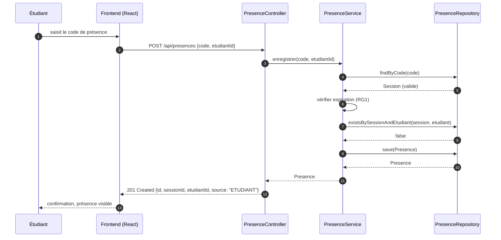
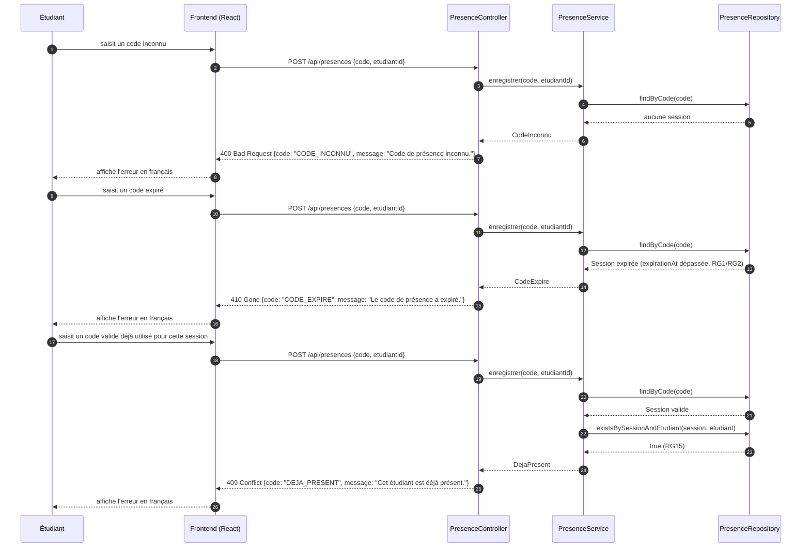

# D3 — Séquence : marquer sa présence

**Cas d'utilisation** : UC5 (Marquer sa présence avec un code)  
**Endpoint** : `POST /api/presences`  
**Acteurs** : Étudiant (via le frontend React), PresenceController, PresenceService, PresenceRepository.  
**Règles couvertes** : RG1 (expiration 15 min), RG2 (pas après expiration), RG3 (blocage 5 erreurs / 2 min), RG15 (unicité présence).

## Scénario nominal

```mermaid
sequenceDiagram
    autonumber
    participant E as Étudiant
    participant F as Frontend (React)
    participant C as PresenceController
    participant S as PresenceService
    participant R as PresenceRepository

    E->>F: saisit le code de présence
    F->>C: POST /api/presences {code, etudiantId}
    C->>S: enregistrer(code, etudiantId)
    S->>R: findByCode(code)
    R-->>S: Session (valide)
    S->>S: vérifier expiration (RG1)
    S->>R: existsBySessionAndEtudiant(session, etudiant)
    R-->>S: false
    S->>R: save(Presence)
    R-->>S: Presence
    S-->>C: Presence
    C-->>F: 201 Created {id, sessionId, etudiantId, source: "ETUDIANT"}
    F-->>E: confirmation, présence visible
```

## Scénarios d'erreur

```mermaid
sequenceDiagram
    autonumber
    participant E as Étudiant
    participant F as Frontend (React)
    participant C as PresenceController
    participant S as PresenceService
    participant R as PresenceRepository

    E->>F: saisit un code inconnu
    F->>C: POST /api/presences {code, etudiantId}
    C->>S: enregistrer(code, etudiantId)
    S->>R: findByCode(code)
    R-->>S: aucune session
    S-->>C: CodeInconnu
    C-->>F: 400 Bad Request {code: "CODE_INCONNU", message: "Code de présence inconnu."}
    F-->>E: affiche l'erreur en français

    E->>F: saisit un code expiré
    F->>C: POST /api/presences {code, etudiantId}
    C->>S: enregistrer(code, etudiantId)
    S->>R: findByCode(code)
    R-->>S: Session expirée (expirationAt dépassée, RG1/RG2)
    S-->>C: CodeExpire
    C-->>F: 410 Gone {code: "CODE_EXPIRE", message: "Le code de présence a expiré."}
    F-->>E: affiche l'erreur en français

    E->>F: saisit un code valide déjà utilisé pour cette session
    F->>C: POST /api/presences {code, etudiantId}
    C->>S: enregistrer(code, etudiantId)
    S->>R: findByCode(code)
    R-->>S: Session valide
    S->>R: existsBySessionAndEtudiant(session, etudiant)
    R-->>S: true (RG15)
    S-->>C: DejaPresent
    C-->>F: 409 Conflict {code: "DEJA_PRESENT", message: "Cet étudiant est déjà présent."}
    F-->>E: affiche l'erreur en français
```

## Codes HTTP imposés par le contrat

| Résultat | Statut HTTP | Code d'erreur |
|---|---:|---|
| Présence enregistrée | 201 Created | — |
| Code inconnu | 400 Bad Request | `CODE_INCONNU` |
| Présence déjà enregistrée pour l'étudiant et la session | 409 Conflict | `DEJA_PRESENT` |
| Code expiré | 410 Gone | `CODE_EXPIRE` |

Toutes les réponses d'erreur utilisent le format JSON `{ "code": "...", "message": "..." }`, avec un message lisible en français, et ne contiennent aucune stack trace.

## Règle RG3 — blocage après erreurs répétées

Après cinq tentatives erronées consécutives, l'étudiant est bloqué pendant deux minutes conformément à Q4/RG3. Le contrat imposé pour `POST /api/presences` ne définit pas de statut HTTP ni de code d'erreur pour ce blocage ; ce cas sera décrit comme extension dans `api/contrat.yaml` avant son implémentation, sans modifier les statuts imposés ci-dessus.
