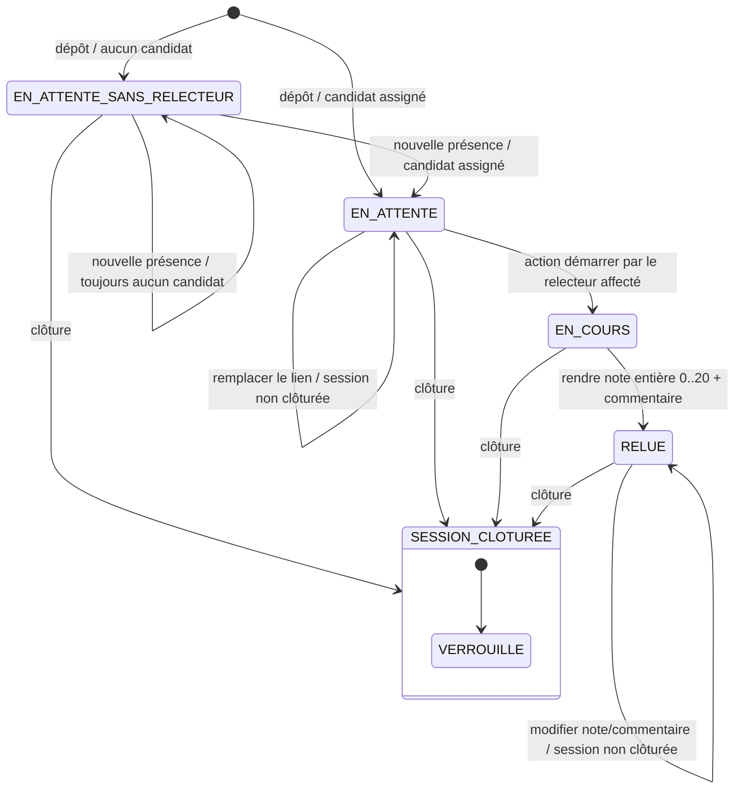

# D4 — États-transitions du cycle de vie d’un exercice

**Invariants :** un exercice n’a qu’un relecteur ; l’auteur ne peut pas être relecteur ; le remplacement du lien n’est permis qu’en attente ; modification et démarrage sont interdits après clôture. La clôture verrouille les mutations sans effacer l’état métier antérieur.
