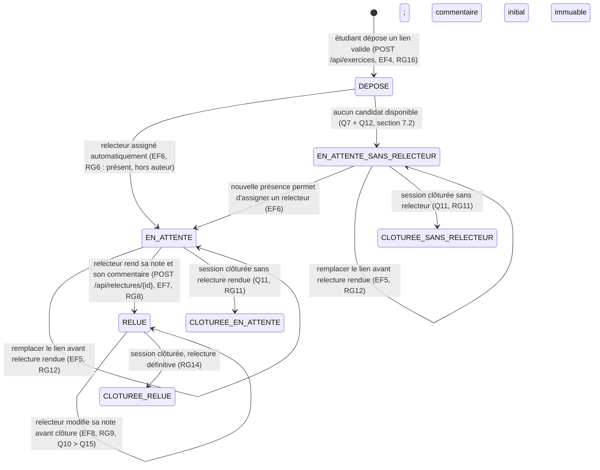

# D4 — États-transitions du cycle de vie d'un exercice (BONUS)

**Objet** : un Exercice déposé par un étudiant pour une session.  
**Statuts possibles** (cohérents avec D2, colonne `Exercice.statut`) :
- `DEPOSE`
- `EN_ATTENTE`
- `EN_ATTENTE_SANS_RELECTEUR`
- `RELUE`

**Règles couvertes** : RG4 (pas d'auto-relecture), RG5 (un seul relecteur), RG9 (Q10 > Q15 : commentaire immuable, note modifiable avant clôture), RG11 (dépôt jusqu'à clôture), RG12 (remplacement tant que non relu), RG16 (un exercice par étudiant et par session).

```mermaid
stateDiagram-v2
    [*] --> DEPOSE: étudiant dépose un lien valide (POST /api/exercices, EF4, RG16)

    DEPOSE --> EN_ATTENTE: relecteur assigné automatiquement (EF6, RG6 : présent, hors auteur)
    DEPOSE --> EN_ATTENTE_SANS_RELECTEUR: aucun candidat disponible (Q7 + Q12, section 7.2)

    EN_ATTENTE_SANS_RELECTEUR --> EN_ATTENTE: nouvelle présence permet d'assigner un relecteur (EF6)

    EN_ATTENTE --> EN_ATTENTE: remplacer le lien avant relecture rendue (EF5, RG12)
    EN_ATTENTE_SANS_RELECTEUR --> EN_ATTENTE_SANS_RELECTEUR: remplacer le lien avant relecture rendue (EF5, RG12)

    EN_ATTENTE --> RELUE: relecteur rend sa note et son commentaire (POST /api/relectures/{id}, EF7, RG8)

    RELUE --> RELUE: relecteur modifie sa note avant clôture (EF8, RG9, Q10 > Q15) ; commentaire initial immuable

    EN_ATTENTE --> CLOTUREE_EN_ATTENTE: session clôturée sans relecture rendue (Q11, RG11)
    EN_ATTENTE_SANS_RELECTEUR --> CLOTUREE_SANS_RELECTEUR: session clôturée sans relecteur (Q11, RG11)
    RELUE --> CLOTUREE_RELUE: session clôturée, relecture définitive (RG14)

    state CLOTUREE_EN_ATTENTE <<final>>
    state CLOTUREE_SANS_RELECTEUR <<final>>
    state CLOTUREE_RELUE <<final>>
```

## Note sur l'état DEPOSE

L'état DEPOSE est un état interne transitoire : la transition
[*] → DEPOSE → (EN_ATTENTE | EN_ATTENTE_SANS_RELECTEUR) se produit
dans la même transaction que le POST /api/exercices. Le statut DEPOSE
n'est jamais observé par un client de l'API : la réponse 201 contient
directement soit EN_ATTENTE (relecteur assigné), soit
EN_ATTENTE_SANS_RELECTEUR (aucun candidat disponible).

Cette simplification évite une race condition entre le dépôt de
l'exercice et l'assignation du relecteur, et rend le comportement
testable en un seul appel API.

## Description des transitions

| De | Vers | Déclencheur | Règle |
|---|---|---|---|
| `[*]` | `DEPOSE` | Étudiant dépose un lien valide | EF4, RG16 |
| `DEPOSE` | `EN_ATTENTE` | Relecteur assigné automatiquement | EF6, RG6 |
| `DEPOSE` | `EN_ATTENTE_SANS_RELECTEUR` | Aucun candidat disponible | Q7 + Q12, section 7.2 |
| `EN_ATTENTE_SANS_RELECTEUR` | `EN_ATTENTE` | Une nouvelle présence permet l'assignation | EF6 |
| `EN_ATTENTE` | `EN_ATTENTE` | L'étudiant remplace le lien avant relecture rendue | EF5, RG12 |
| `EN_ATTENTE_SANS_RELECTEUR` | `EN_ATTENTE_SANS_RELECTEUR` | L'étudiant remplace le lien avant relecture rendue | EF5, RG12 |
| `EN_ATTENTE` | `RELUE` | Le relecteur rend une note et un commentaire | EF7, RG8 |
| `RELUE` | `RELUE` | Le relecteur modifie uniquement sa note avant clôture | EF8, RG9, Q10 > Q15 |
| `EN_ATTENTE` | `CLOTUREE_EN_ATTENTE` | Session clôturée sans relecture | RG11, Q11 |
| `EN_ATTENTE_SANS_RELECTEUR` | `CLOTUREE_SANS_RELECTEUR` | Session clôturée sans relecteur | RG11, Q11 |
| `RELUE` | `CLOTUREE_RELUE` | Session clôturée | RG14 |

## Règles d'immuabilité

- **Commentaire** : immuable après la première soumission (RG9, Q10 > Q15).
- **Note** : modifiable tant que la session n'est pas clôturée ; après clôture, elle est définitive (RG9, RG14, Q10).
- **Lien de l'exercice** : remplaçable tant que la relecture n'a pas été rendue (`EN_ATTENTE` ou `EN_ATTENTE_SANS_RELECTEUR`, RG12, Q13). Dès que le statut est `RELUE`, le lien est figé.
- **Relecteur** : jamais l'auteur de l'exercice (RG4, Q5). Un seul relecteur par exercice (RG5, Q6). `relecteurId` est nullable en `EN_ATTENTE_SANS_RELECTEUR`.

## Cohérence avec les autres diagrammes

- **D2** : les quatre statuts métier sont ceux de la colonne `Exercice.statut` ; `Exercice.relecteurId` est nullable, ce qui justifie `EN_ATTENTE_SANS_RELECTEUR`.
- **D3** : les présences enregistrées permettent de constituer la liste des candidats relecteurs.
- **CDC section 7.2** : Q7 + Q12 fonde l'état `EN_ATTENTE_SANS_RELECTEUR` lorsqu'aucun candidat admissible n'est disponible.
